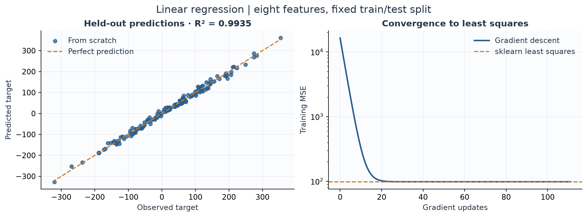
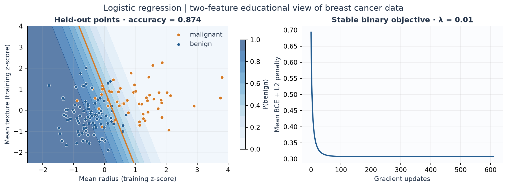
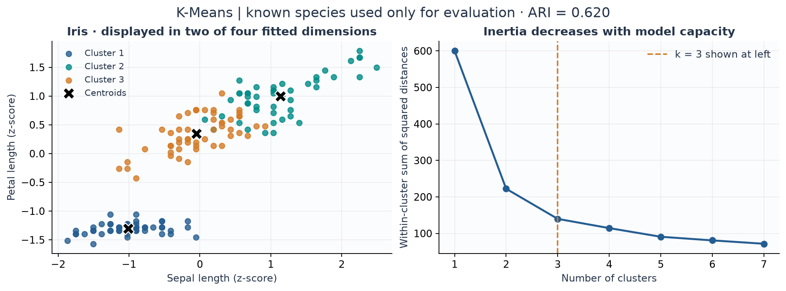
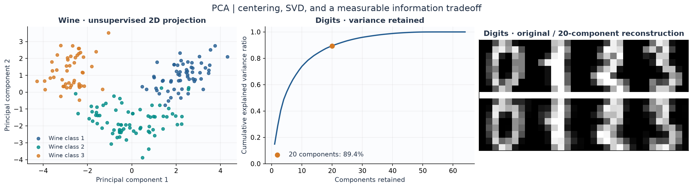

# Machine Learning Algorithms from Scratch

Linear regression, binary logistic regression, gradient descent, K-Means and PCA,
implemented from first principles with **NumPy as the only runtime dependency**.
The package connects mathematical derivations to readable implementations and validates
their behavior against scikit-learn on six offline datasets.

[Browse the algorithms](src/ml_from_scratch) · [Read the mathematics](docs/mathematics.md) ·
[Inspect generated benchmarks](benchmarks/results/results.md) · [Explore the tests](tests)

## Why this project

High-level libraries make model fitting convenient while hiding the choices that determine
correctness: loss scaling, intercept handling, numerical stability, initialization and
stopping criteria. This project makes those decisions explicit and tests them as software.
It combines numerical computing and mathematical reasoning with a small, installable Python
package designed for inspection and reproducible experiments.

## Implemented algorithms

| Algorithm | Key concepts | API | Reference validation |
| --- | --- | --- | --- |
| Linear regression | MSE gradients; centered least squares | `fit`, `predict`, `score` | Held-out MSE, $R^2$, prediction differences |
| Logistic regression | Stable sigmoid and cross entropy; optional L2 | `fit`, `predict`, `predict_proba`, `score` | Accuracy, F1, log loss, probability differences |
| Gradient descent | Full-batch fixed steps; gradient-norm stopping | `minimize` | Analytic quadratics, gradient checks, regression optimum |
| K-Means | Lloyd updates; K-Means++; multistart selection | `fit`, `predict`, `fit_predict` | Inertia and permutation-invariant ARI |
| PCA | Centered thin SVD; variance; reconstruction | `fit`, `transform`, `fit_transform`, `inverse_transform` | Variance, reconstruction and subspace projectors |

## Highlights

- Shared validation, fitted-state errors, typed APIs and explicit convergence reporting.
- Stable logit-space loss, rank-deficient least squares and empty-cluster handling.
- Analytic, edge-case and scikit-learn comparison tests; a **90% branch-inclusive coverage gate**.
- Executed CSV/JSON/Markdown benchmarks with seeds, preprocessing, solver settings and environment metadata.
- Five educational notebooks and five scripted figures using the same tested package code.
- GitHub Actions for lint, formatting, types, tests, notebooks and artifact generation.

## Architecture

```text
src/ml_from_scratch/
├── linear_model/      # Linear and binary logistic regression
├── optimization/      # Shared gradient descent
├── cluster/           # K-Means
├── decomposition/     # PCA
├── metrics/           # Regression, classification and clustering scores
└── utils/             # Validation and numerical primitives
tests/                 # Correctness, API, numerical and reference tests
benchmarks/            # Six offline datasets and independent sklearn metrics
notebooks/             # Five sequential educational demonstrations
docs/                  # Derivations, architecture and methodology
scripts/               # Figure generation and executable-documentation checks
assets/                # Reproducible selected figures
.github/workflows/     # CI
```

The [architecture guide](docs/architecture.md) explains dependency boundaries and API
contracts. Core modules import only NumPy, the standard library and this package;
an automated test enforces that boundary.

## Quick start

Use **Python 3.11 or newer**. From the repository directory after cloning or downloading it:

```bash
python -m venv .venv
```

Activate the environment on macOS/Linux:

```bash
source .venv/bin/activate
```

Or in Windows PowerShell:

```powershell
.venv\Scripts\Activate.ps1
```

Then install the package and development tools:

```bash
python -m pip install -e ".[dev]"
python -m pytest --cov=ml_from_scratch --cov-report=term-missing --cov-report=xml
```

Activation is optional: on Windows you can use `.venv\Scripts\python.exe` in place of
`python` in every command. `python -m pip install .` installs only the runtime package
and NumPy. Datasets require no downloads after dependencies are installed.

## Usage

Each example below runs independently; the documentation verifier executes these exact blocks.
Inputs are dense numeric matrices with samples in rows and one-dimensional targets.

### Linear regression

```python
import numpy as np
from ml_from_scratch import LinearRegression

X = np.array([[-2.0], [-1.0], [0.0], [1.0], [2.0]])
y = 3.0 * X[:, 0] + 2.0
model = LinearRegression(solver="gd", learning_rate=0.1, tol=1e-8).fit(X, y)
np.testing.assert_allclose(model.predict([[3.0]]), [11.0], atol=1e-6)
assert model.converged_
```

`solver="normal"` (the default) uses centered `np.linalg.lstsq`, avoiding explicit matrix
inversion. Both solvers support multiple features and an optional intercept.

### Logistic regression

```python
import numpy as np
from ml_from_scratch import LogisticRegression

X = np.array([[-2.0], [-1.0], [1.0], [2.0]])
y = np.array([0, 0, 1, 1])
model = LogisticRegression(l2=0.1, threshold=0.5).fit(X, y)
probabilities = model.predict_proba(X)  # Columns are P(y=0), P(y=1).
np.testing.assert_allclose(probabilities.sum(axis=1), 1.0)
np.testing.assert_array_equal(model.predict(X), y)
```

Training requires both binary labels 0 and 1. The objective is mean binary cross entropy
plus `l2 / 2 * ||coef_||²`; the intercept is unpenalized. Scale features for fixed-step GD.

### Gradient descent

```python
import numpy as np
from ml_from_scratch import GradientDescent


def objective(theta):
    residual = theta - np.array([2.0, -1.0])
    return float(residual @ residual), 2.0 * residual


optimizer = GradientDescent(learning_rate=0.2, tol=1e-8).minimize(objective, np.zeros(2))
np.testing.assert_allclose(optimizer.params_, [2.0, -1.0], atol=1e-7)
assert len(optimizer.loss_history_) == optimizer.n_iter_ + 1
```

Iterations stop when the gradient norm is at most `tol`. Exhausting `max_iter` emits
`ConvergenceWarning`; a materially increasing loss or nonfinite arithmetic raises an error
with guidance to lower the step size or scale features.

### K-Means

```python
import numpy as np
from ml_from_scratch import KMeans

X = np.array([[0.0, 0.0], [0.0, 1.0], [8.0, 8.0], [8.0, 9.0]])
model = KMeans(n_clusters=2, n_init=10, random_state=42)
labels = model.fit_predict(X)
np.testing.assert_array_equal(labels, model.predict(X))
assert model.cluster_centers_.shape == (2, 2)
assert np.isclose(model.inertia_, 1.0)
```

Cluster IDs are arbitrary. Empty clusters are reseeded; duplicate observations can yield
fewer occupied clusters than requested. The seed controls a local NumPy generator.

### PCA

```python
import numpy as np
from ml_from_scratch import PCA

X = np.array([[-2.0, -4.0], [-1.0, -2.0], [1.0, 2.0], [2.0, 4.0]])
model = PCA(n_components=1)
projected = model.fit_transform(X)
reconstructed = model.inverse_transform(projected)
assert projected.shape == (4, 1)
np.testing.assert_allclose(reconstructed, X, atol=1e-12)
```

PCA centers features but does not standardize or whiten. Component signs are arbitrary;
the projection subspace and reconstruction are the meaningful comparison objects.

## Mathematics

The [mathematics guide](docs/mathematics.md) derives both regression gradients, explains
learning-rate and convergence conditions, derives Lloyd's centroid updates, and connects
PCA variance maximization to SVD and reconstruction error. It also documents objective
normalization, L2 scaling, metric edge cases and sign/label ambiguity.

## Benchmarks

These are **executed results**, with seed 42, from the checked-in
[machine-readable run](benchmarks/results/results.json). Supervised rows evaluate a held-out
25% split. K-Means and PCA rows evaluate whole-dataset exploratory fits. Preprocessing and
settings are fixed before comparison; see [methodology](docs/benchmarking.md).

<!-- benchmark-summary:start -->

| Algorithm | Dataset | Metric | From scratch | scikit-learn | Absolute difference | Relative difference |
| :-- | :-- | :-- | --: | --: | --: | --: |
| LinearRegression(gd) | synthetic_regression | test_mse | 93.242 | 93.242 | 2.09727e-08 | 2.24927e-10 |
| LinearRegression(gd) | diabetes | test_mse | 2848.31 | 2848.31 | 1.96955e-06 | 6.91481e-10 |
| LogisticRegression | breast_cancer | test_accuracy | 0.986014 | 0.986014 | 0 | 0 |
| KMeans | iris | inertia | 139.82 | 139.82 | 8.52651e-14 | 6.09819e-16 |
| KMeans | wine | inertia | 1277.93 | 1277.93 | 9.09495e-13 | 7.11695e-16 |
| PCA | iris | reconstruction_mse | 0.0418679 | 0.0418679 | 6.93889e-18 | 1.65733e-16 |
| PCA | wine | reconstruction_mse | 0.198377 | 0.198377 | 5.55112e-17 | 2.79826e-16 |
| PCA | digits | reconstruction_mse | 0.00775101 | 0.00775101 | 8.67362e-19 | 1.11903e-16 |

<!-- benchmark-summary:end -->

The [full table](benchmarks/results/results.md) includes $R^2$, F1, log loss, prediction
differences, cluster ARI and subspace checks. The display is rounded; small nonzero
differences remain visible in their own columns and in JSON/CSV. Agreement on these tasks
supports correctness on the tested conditions; it is not evidence that the implementations
are interchangeable across all datasets.

Runtime is recorded for context, not as a speed claim. Fixed-step GD, NumPy linear algebra,
reference solvers and K-Means initialization use different numerical paths. Matching
integer seeds does not imply matching random draws across implementations.

Regenerate every result and refresh this table:

```bash
python -m benchmarks.run_all --update-readme
```

The six unique datasets are synthetic regression, diabetes, breast cancer, Iris, Wine and
Digits. See [results metadata](benchmarks/results/results.json) for the executed environment.

## Visualizations









The [gradient descent figure](assets/gradient_descent.png) compares step sizes on a quadratic.
Regenerate all five figures with `python scripts/generate_figures.py`.

## Notebooks

| Notebook | Focus |
| --- | --- |
| [01 — Linear regression](notebooks/01_linear_regression.ipynb) | Closed-form and gradient-based fitting with reference predictions |
| [02 — Logistic regression](notebooks/02_logistic_regression.ipynb) | Probabilities, regularized loss and classification |
| [03 — Gradient descent](notebooks/03_gradient_descent.ipynb) | Step size, convergence and an analytical optimum |
| [04 — K-Means](notebooks/04_kmeans.ipynb) | Unsupervised structure and label-invariant evaluation |
| [05 — PCA](notebooks/05_pca.ipynb) | Variance, projection and reconstruction |

Each notebook imports the package, develops the mathematics, runs an experiment, plots
results and compares a reference. To explore interactively, install `.[notebooks]` and run
`python -m jupyterlab`. To verify all five in clean kernels, use the command below.

## Testing and developer commands

Latest local acceptance: **241 tests passed, 98.41% branch-inclusive coverage**, with all five
notebooks and all five README examples executed successfully.

All commands run from the repository root after installing `.[dev]`. Make is optional;
the Python equivalents work in PowerShell, Bash and CI.

| Task | Command | Make shortcut |
| --- | --- | --- |
| Install | `python -m pip install -e ".[dev]"` | `make install` |
| Tests and coverage | `python -m pytest --cov=ml_from_scratch --cov-report=term-missing --cov-report=xml` | `make test` |
| Lint | `python -m ruff check .` | `make lint` (also checks formatting) |
| Check formatting | `python -m ruff format --check .` | `make lint` |
| Format | `python -m ruff format .` | `make format` (also fixes lint) |
| Types | `python -m mypy` | `make typecheck` |
| Benchmarks | `python -m benchmarks.run_all` | `make benchmark` |
| Figures | `python scripts/generate_figures.py` | `make figures` |
| README, links and CI structure | `python scripts/verify_artifacts.py` | `make verify` |
| Also execute notebooks | `python scripts/verify_artifacts.py --notebooks` | `make notebooks` |
| Build wheel and source distribution | `python -m build` | `make build` |

Tests cover known coefficients, finite-difference gradients, probability bounds, singular
designs, duplicate clusters, reconstruction, invalid inputs, numerical failures, failed
refits, determinism and reference agreement. Warnings are errors unless explicitly expected.
The [CI workflow](.github/workflows/ci.yml) tests Python 3.11 and 3.13 on Linux without secrets.
Local acceptance evidence is recorded in [verification](docs/verification.md).

## Design decisions

NumPy supplies array operations and linear algebra; every estimator's objective, gradients,
updates, convergence and API are implemented here. scikit-learn is confined to independent
validation, dataset loading and demonstrations. Shared utilities keep validation consistent,
and one optimizer connects the mathematical objectives to the supervised estimators.

No remote repository URL, hosted CI badge or performance claim is invented. Suggested
GitHub description and topics are available in [repository metadata](docs/repository-metadata.md).

## Limitations

This is an educational implementation with software-engineering checks. It does not aim
to replace optimized production libraries such as scikit-learn.

- Dense, real, finite arrays only; no sparse matrices, missing-value imputation or sample weights.
- Single-target linear regression and binary 0/1 logistic regression; no multiclass solver.
- Fixed-step full-batch GD can converge slowly on poorly conditioned features. Features are not automatically standardized.
- K-Means can reach local optima; absolute stopping tolerance and initialization differ from scikit-learn.
- Full thin-SVD PCA has no whitening, randomized solver or incremental mode.
- The API follows familiar estimator conventions but does not implement sklearn cloning, parameter search or pipeline integration.
- Benchmarks use one fixed supervised split and selected small datasets; they do not estimate generalization uncertainty or establish runtime superiority.

## Future improvements

Repeated-split evaluation with uncertainty estimates, a documented backtracking line search,
weighted objectives, and incremental PCA would each add distinct engineering or mathematical
value. These are outside the implemented scope.

## License

[MIT](LICENSE).
