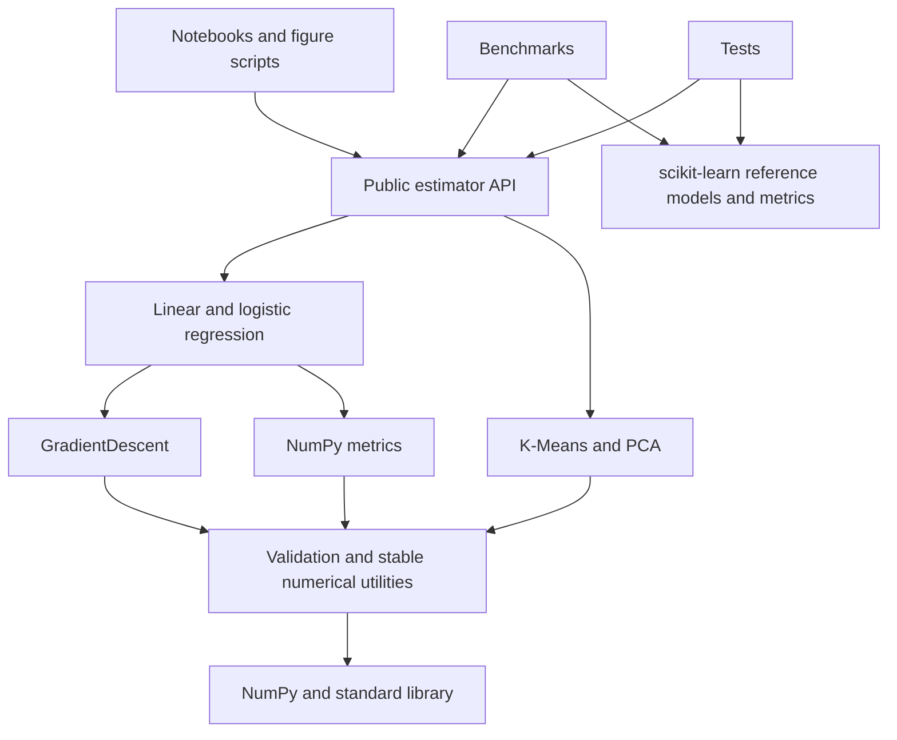

# Architecture and API contracts

The package is intentionally small: algorithm-specific estimators, one reusable optimizer,
shared validators and numerical primitives, and standalone metrics. There is no estimator
inheritance hierarchy or registry.

## Repository map

| Location | Responsibility |
| --- | --- |
| [`src/ml_from_scratch`](../src/ml_from_scratch) | Installable package; NumPy is its only external runtime dependency |
| [`tests`](../tests) | Analytic answers, finite differences, API validation, edge cases, reference parity |
| [`benchmarks`](../benchmarks) | Dataset loading, experimental preprocessing, reference estimators, result generation |
| [`benchmarks/results`](../benchmarks/results) | Executed CSV/JSON/Markdown evidence and environment metadata |
| [`scripts`](../scripts) | Reproducible figures and executable-documentation verification |
| [`notebooks`](../notebooks) | Five sequential educational demonstrations that import installed package code |
| [`docs`](.) | Mathematical derivations, design contracts, benchmark methodology |
| [`assets`](../assets) | Selected reproducible figures used in the README |
| [CI workflow](../.github/workflows/ci.yml) | Lint, formatting, types, coverage, notebooks, artifacts, distribution build |

The structure follows the original src-based design. A shared benchmark helper keeps
preprocessing and output formatting consistent. `verify_artifacts.py` adds executable
documentation checks. Neither is imported by the core package.

## Estimator conventions

All estimators accept array-like inputs and `fit` returns `self`. Feature matrices have
shape `(n_samples, n_features)` and targets have shape `(n_samples,)`. Column-vector targets
are deliberately rejected. Inputs must be finite real numeric data; implicit conversion
of strings or complex numbers is rejected. Inputs are never modified in place.

Learned attributes end with `_`. Calling inference before successful fitting raises
`NotFittedError`, a `ValueError` subclass. Prediction and transformation reject feature
counts different from training. Hyperparameters are validated at construction; create a
new estimator to change them. This is an sklearn-inspired API, not full compatibility with
`clone`, `GridSearchCV`, pipelines, or estimator tags.

| Object | Main methods | Learned outputs |
| --- | --- | --- |
| `GradientDescent` | `minimize(objective, initial_params)` | `params_`, `loss_history_`, `n_iter_`, `converged_` |
| `LinearRegression` | `fit`, `predict`, `score` ($R^2$) | `coef_` (1D), `intercept_` (scalar), history and convergence |
| `LogisticRegression` | `fit`, `predict`, `predict_proba`, `score` (accuracy) | `coef_` (1D), `intercept_`, `classes_`, history and convergence |
| `KMeans` | `fit`, `predict`, `fit_predict` | `cluster_centers_`, `labels_`, `inertia_`, `inertia_history_`, iterations and convergence |
| `PCA` | `fit`, `transform`, `fit_transform`, `inverse_transform` | `mean_`, `components_`, `singular_values_`, explained variance and ratios |

Every estimator records `n_features_in_`. PCA also records `n_components_`. Binary logistic
regression requires both 0 and 1 in training; probability columns follow `classes_ = [0, 1]`.
Thresholds include the endpoints 0 and 1, with equality assigned to the positive class.

The direct linear solver reports `n_iter_=0`, `converged_=True`, and a one-element history
containing its final loss. GD and K-Means histories include initialization and each update.
Iterative solvers expose their convergence status and warn when the iteration budget is
exhausted. Overflow is reported explicitly, not hidden behind NaN predictions.

## Numerical and dependency decisions

The supervised objectives share fixed-step gradient descent. Regression uses centered
least squares for the direct solver; logistic loss uses signed logits and `logaddexp`.
PCA uses thin SVD and a two-part mean to retain centering accuracy under large common offsets.
K-Means subtracts coordinates directly to avoid cancellation in expanded
squared-distance formulas and keeps distance temporaries bounded to an observation matrix
and an `(n_samples, n_clusters)` distance matrix. These choices favor readable numerical
code over matching a production library's optimizations.

scikit-learn appears only in tests, experiments and demonstrations. Benchmark metrics use
the reference library independently on both sets of predictions; this avoids validating
an estimator with a potentially matching bug in our metric implementation. Our metrics
have their own reference and analytic tests.

Notebooks import the package rather than redefine estimators. The same tested code powers
examples, benchmarks and figures. The src layout ensures an install is required to import
the project, which helps expose packaging mistakes.

## Testing and verification

Tests combine known solutions, numerical gradient checks, fixed random seeds, invalid
inputs, fitted-state errors, convergence exhaustion, overflow, non-mutation and independent
scikit-learn agreement. Clustering comparisons are invariant under label permutation;
PCA comparisons account for sign and subspace ambiguity. Warnings are errors in pytest
unless a test explicitly expects one.

Coverage includes branches, with a 90% minimum on the runtime package. Ruff checks source,
scripts, tests and notebook code cells; mypy checks the typed runtime package. The artifact
verifier executes every README Python example, resolves local Markdown paths, validates
the CI YAML structure, and can execute every notebook in a fresh kernel using the active
Python interpreter. Timing is excluded from deterministic regression assertions.

CI runs Python 3.11 and 3.13 on Linux, generates coverage, executes documentation, regenerates
experiments on one matrix leg, and builds source/wheel distributions. Hosted CI results
exist only after the repository is pushed; local verification is recorded separately.
